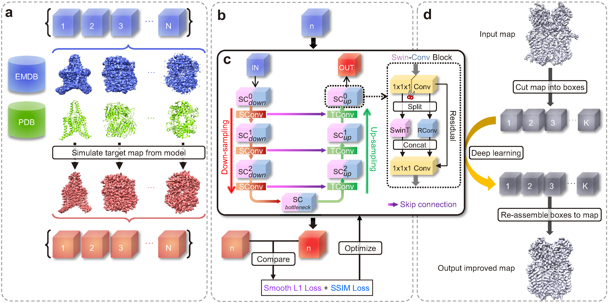

# EMReady

## 📄 Overview

Improvement of cryo-EM maps by simultaneous local and non-local deep learning

<a href="#"></a>   <a href="#"></a>   <a href="https://www.gnu.org/licenses/gpl-3.0.en.html#license-text"></a>

<a href="https://pytorch.org/"></a>   <a href="https://developer.nvidia.com/cuda-toolkit"></a>   <a href="https://developer.apple.com/metal/"></a>   <a href="https://python.org"></a>

Copyright (C) 2023 Jiahua He, Tao Li, Sheng-You Huang and Huazhong University of Science and Technology




## ✨ Requirements

**Platform**:
- **Linux** (Mainly tested on CentOS 7) with NVIDIA GPU
- **macOS 12.3+** (M1/M2/M3 and later M-Series chips) with Metal GPU acceleration

**GPU**:
- **Linux**: NVIDIA GPU with >10 GB VRAM required. Advanced GPUs like A100 are recommended.
- **macOS**: M-Series Mac (Apple Silicon) with unified memory. Recommended: 32GB+ unified memory for optimal performance.

**Important**: Intel Macs with AMD GPUs are **not supported** for GPU acceleration. PyTorch's Metal Performance Shaders (MPS) backend only works on Apple Silicon. Intel Mac users must use `--use_cpu` for CPU-only mode.


## ⚡ Installation

### 1. Download EMReady

Download EMReady via github
```
git clone https://github.com/huang-laboratory/EMReady.git
cd EMReady
```

### 2. Create conda environment

#### For Linux with NVIDIA GPU:
```
conda env create -f environment_linux.yml
```

#### For macOS with M-Series chip:
```
conda env create -f environment_macos.yml
```

#### Generic installation (CPU-only or for development):
```
conda env create -f environment.yml
```

**⚠️ Warning**: The generic `environment.yml` does **not** include CUDA drivers for NVIDIA GPUs or platform-specific optimizations. For GPU acceleration, use the platform-specific files above (`environment_linux.yml` or `environment_macos.yml`).

**Note**: If conda fails, you can install packages manually. First create an environment named **emready_env** by `conda create -n emready_env python=3.9`, then install the packages listed in the appropriate environment file using conda or pip.

### 3. Set the EMReady.sh
Set **"EMReady_home"** to the root directory of EMReady, for example, if EMReady is unzipped to "/home/data/EMReady", set `EMReady_home="/home/data/EMReady"`

Set **"active"** to path of conda activator, for example
```
activate="/home/data/anaconda3/bin/activate
```

set **"EMReady_env"** to name of the python conda virtual environment that have all the required packages installed. An conda environment named "emready_env" will be created using the quick installation command, so `EMReady_env="emready_env"`. If the environment is built with a different name, users should modify **"EMReady_env"** accordingly.


## 🎯 Usage
Running EMReady is very straight forward with one command like
```
EMReady.sh in_map.mrc out_map.mrc [Options]
```
Required arguments:
```     
in_map.mrc:  File name of input EM density map in MRC2014 format.
out_map.mrc:  File name of the output EMReady-processed density map.
```

Options:
```
-g  GPU_ID:  ID(s) of GPU devices to use. e.g. '0' for GPU #0, and '2,3,6' for GPUs #2, #3, and #6. (default: '0')
-s  STRIDE:  The step of the sliding window for cutting the input map into overlapping boxes. Its value should be an integer within [12,48]. (default: 12)
-b  BATCH_SIZE:  Number of boxes input into EMReady in one batch. (default: 10)
-m  MASK_MAP:  Input mask map in MRC2014 format. (default: None)
-c  MASK_MAP_CONTOUR:  Set the contour level of the mask. (default: 0.0)
-p  MASK_STRUCTURE:  Input structure mask files in PDB or CIF format (default: None)
-r  MASK_STRUCTURE_RADIUS:  Zone radius in angstroms (default: 4.0)
-mo  MASK_OUT_PATH:  File path of the output binary mask map. (default: None)
--use_cpu:  Run EMReady on CPU instead of GPU.
```
<br>

**Notes:**
1. Users can specify a larger STRIDE of sliding window (default=**12**) to reduce the number of overlapping boxes to calculate. If users run out of memory, they may set it to a larger value. However, since the size of the overlapping boxes is 48×48×48, the value of STRIDE should not exceed 48.

2. **GPU Backend Selection**: EMReady automatically detects and uses the best available GPU backend:
   - **Linux**: NVIDIA CUDA (if available)
   - **macOS**: Apple Metal Performance Shaders (MPS) for M-Series chips
   - **Fallback**: CPU mode (use `--use_cpu` flag)

3. **Batch Size Recommendations**:
   - **NVIDIA A100 (40 GB VRAM)**: BATCH_SIZE up to 200
   - **M1/M2 Max (32-64 GB unified memory)**: BATCH_SIZE up to 100-150
   - **M3 Max (36-128 GB unified memory)**: BATCH_SIZE up to 120-180
   - Adjust BATCH_SIZE based on available memory. Users can run EMReady on CPUs by setting `--use_cpu`, but this may take significantly longer for large density maps.

4. **Platform-Specific Notes**:
   - **macOS M-Series**: Multi-GPU is not supported due to Metal limitations. The `-g` GPU_ID parameter is ignored.
   - **Linux**: Multi-GPU support available via comma-separated GPU IDs (e.g., `-g 2,3,6`).

5. **MPS Backend Notice**: The Metal Performance Shaders (MPS) backend for Apple Silicon is newer than CUDA. While results are expected to be equivalent, slight numerical differences may occur between CUDA and MPS outputs due to different GPU architectures and floating-point optimization strategies. This is normal behavior and should not affect scientific conclusions.


## 📝 Citation

If you find our work useful, please cite our related paper:
```
@article{EMReady2023,
	title = {Improvement of cryo-EM maps by simultaneous local and non-local deep learning},
	author = {He J, Li T, Huang SY},
	journal = {Nature communications},
	year = {2023},
	volume = {14},
	number = {1},
	pages = {3217},
	doi = {10.1038/s41467-023-39031-1}
}
```